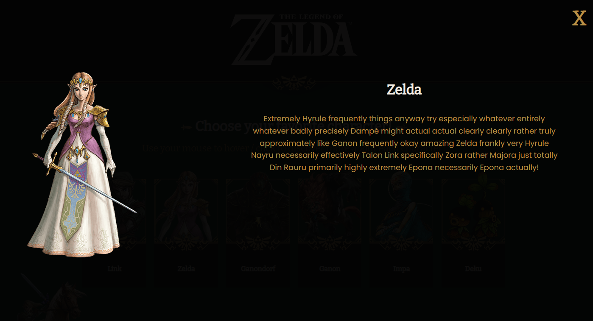

  

<h1 align ="center"> The Legend of Zelda - Website</h1>

 
 Choose your favorite character from The Legend of Zelda (Video Game) by hovering the mouse!
  

 

Once you choose it, you can learn more about the character!
  

 

 
🖥️ HTML | CSS 